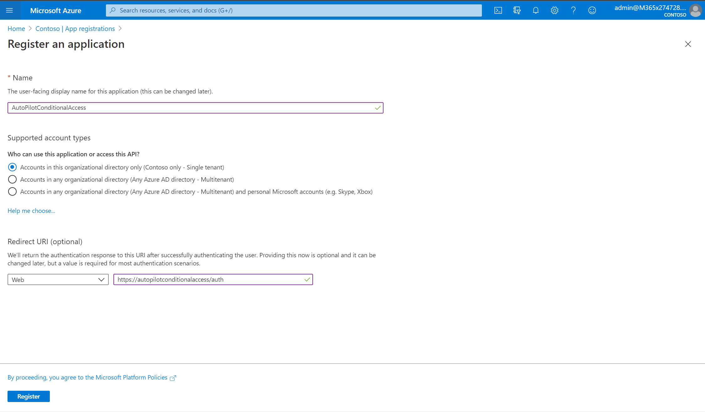
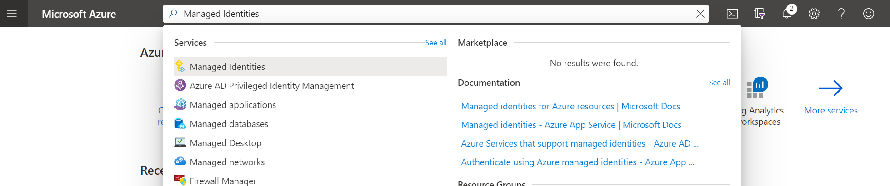
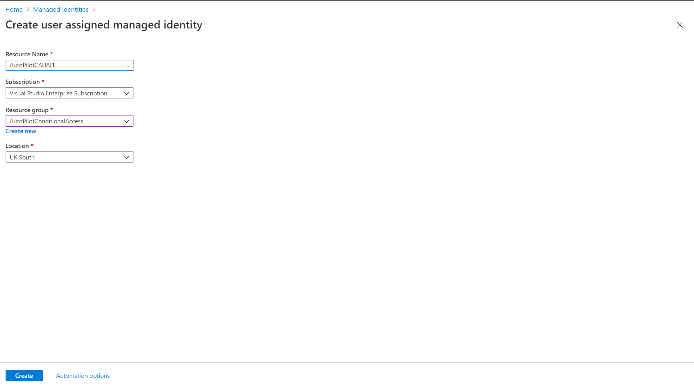
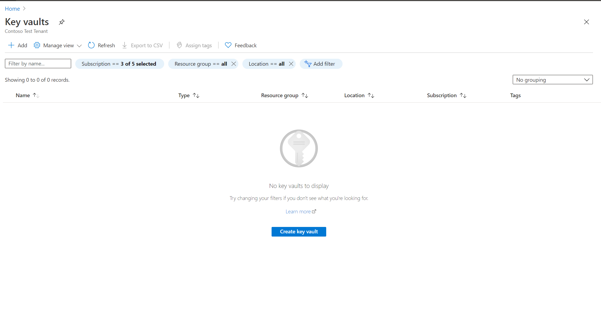
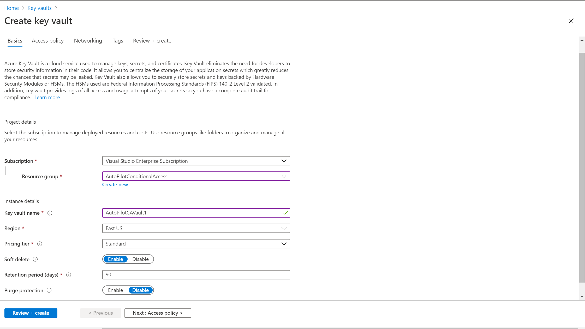
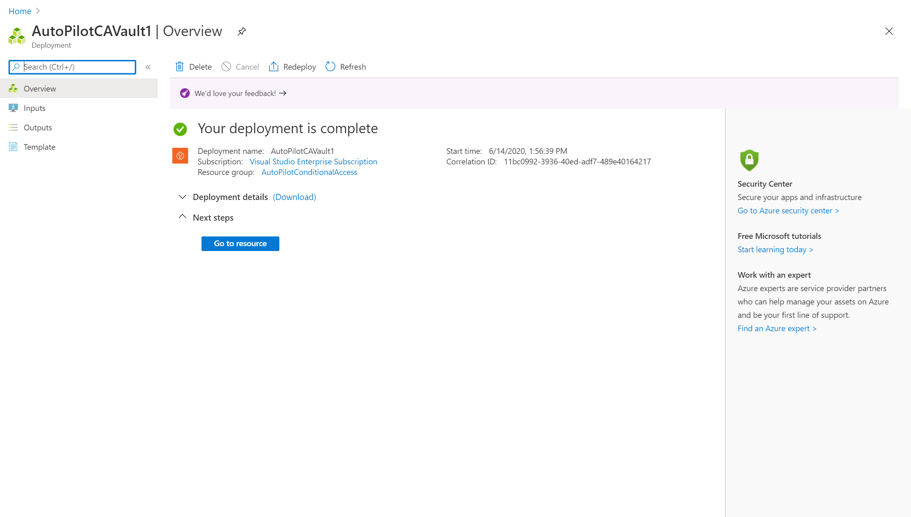
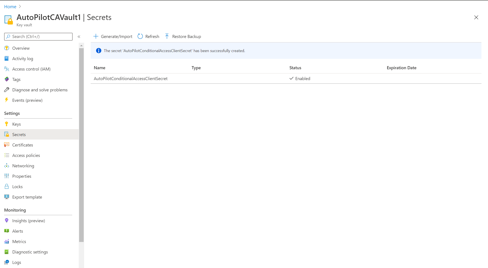
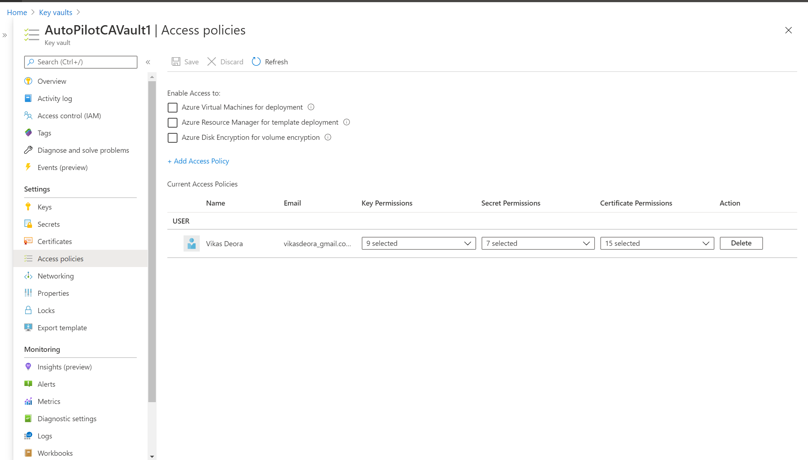
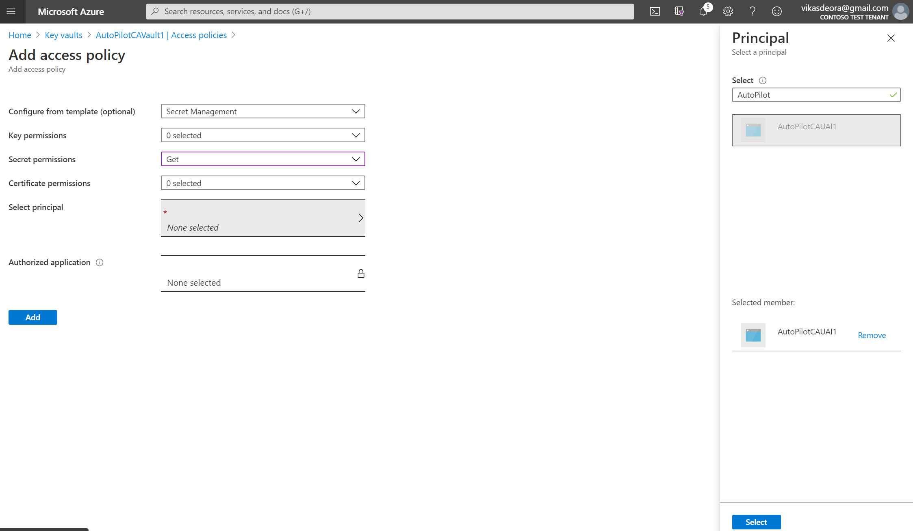

# Secure authentication for Conditional Access automation

Accessing Microsoft Graph endpoints requires that the application or user making the request has the appropriate permissions assigned. These permissions can be one of two types: delegated permissions or application permissions. Delegated permissions, sometimes called “on behalf of” permissions, require a user context to also be supplied when making the request.

To learn more about permissions, app registration and using app-only tokens, see the articles [Register an application with the Microsoft identity platform](https://docs.microsoft.com/graph/auth-register-app-v2) and [Get access without a user](https://docs.microsoft.com/graph/auth-v2-service).

## Application authentication

Some apps call Microsoft Graph with their own identity and not on behalf of a user. In many cases, these are background services or daemons that run on a server without the presence of a signed-in user. An example of such an app might be an email archival service that wakes up and runs overnight. In some cases, apps that have a signed-in user present may also need to call Microsoft Graph under their own identity. For example, an app may need to use functionality that requires more elevated privileges in an organization than those carried by the signed-in user.

Apps that call Microsoft Graph with their own identity use the OAuth 2.0 client credentials grant flow to get access tokens from Azure AD. This article describes the basic steps to configure a service and use the OAuth client credentials grant flow to get an access token.

When we call Conditional Access APIs for break glass account management or other workflows to be executed as background services we would be using app-only permissions..

### Managed identity

Managed identities for Azure resources is a feature of Azure Active Directory, for more information see the article, [What are managed identities for Azure resources](https://docs.microsoft.com/azure/active-directory/managed-identities-azure-resources/overview).

As a identity admin, you are probably looking for the simplest and most secure method to access Conditional Access APIs in your automation.

The managed identities for Azure can help you with this requirement because managed identities:

 * Eliminates the need for credentials.
 * Rotate credentials automatically.
 * Reduces your involvement in managing identities to a minimum.

All Azure resources that support managed identities can obtain tokens to exchange data without having credentials in the code. The process consists of the following steps:

 * Enable – Create the Managed Identity for the resource
 * Grant access – Allow access to resources with Azure Role-Based Access Control (RBAC)
 * Access - Perform the allowed actions
 * Disable – Delete the Managed Identity

Managed identity types

There are two types of managed identities: System-assigned and user-assigned managed identities.

For a common collection of applications and automation tools that need to share a managed identity, you can enable user-assigned managed identities.

For more information about user-assigned managed identities, see the article, [Create a user-assigned managed identity](https://docs.microsoft.com/azure/active-directory/managed-identities-azure-resources/how-to-manage-ua-identity-portal#create-a-user-assigned-managed-identity).

### Azure Key Vault

Azure Key Vault helps with secrets management. Azure Key Vault can be used to Securely store and tightly control access to tokens, passwords, certificates, API keys, and other secrets. For more information about how to use Azure Key Vault, see the article [About Azure Key Vault](https://docs.microsoft.com/azure/key-vault/general/overview).

Centralizing storage of application secrets in Azure Key Vault allows you to control their distribution. Key Vault greatly reduces the chances that secrets may be accidentally leaked. When using Key Vault, application admins no longer need to store security information in their automation workflow. Not having to store security information in automation workflows eliminates the need to make this information part of the code. For example, an automation may need to connect to a conditional access APIs. Instead of storing the client secret in the automation code, you can store it securely in Key Vault.

Your automation script can then securely access the information they need by using URIs. These URIs allow the applications to retrieve specific versions of a secret. There is no need to write custom code to protect any of the secret information stored in Key Vault.

## Step 1: Register an application with the Microsoft identity platform

This page shows you how to add and register an application using the App registrations experience in the Azure portal so that your app can be integrated with the Microsoft identity platform and call Microsoft Graph.

Register a new application using the Azure portal

1. Sign in to the Azure portal using either a work or school account or a personal Microsoft account.
1. If your account gives you access to more than one tenant, select your account in the top right corner, and set your portal session to the Azure AD tenant that you want.
1. In the left-hand navigation pane, select the Azure Active Directory service, and then select App registrations > New registration.
1. When the Register an application page appears, enter your application's registration information.
   1. Name - Enter a meaningful application name that will be displayed to users of the app.
   1. Supported account types - Select Accounts in this organizational directory only.
1. When finished, select Register.

   

With the OAuth 2.0 client credentials grant flow, your app authenticates directly at the Microsoft identity platform /token endpoint using the Application ID assigned by Azure AD and the Application Secret that you create using the portal.

## Step 2: Configure permissions for Microsoft Graph and secret

For apps that call Microsoft Graph under their own identity, Microsoft Graph exposes application permissions (Microsoft Graph can also expose delegated permissions for apps that call Microsoft Graph on behalf of a user). You pre-configure the application permissions your app needs when you register your app. Application permissions always require administrator consent. An administrator can either consent to these permissions using the Azure portal when your app is installed in their organization, or you can provide a sign-up experience in your app through which administrators can consent to the permissions you configured. Once administrator consent is recorded by Azure AD, your app can request tokens without having to request consent again. For more detailed information about the permissions available with Microsoft Graph, see the Permissions reference

To configure application permissions for your app in the Azure app registrations portal: under an application's API permissions page, choose Add a permission, select Microsoft Graph, and then choose the permissions your app requires under Application permissions.

The following screenshot shows the Application Permissions required for Microsoft Graph Conditional Access automation.

Generate The Application Secret for your app in the app registration portal.

## Step 3: Create a user-assigned managed identity

1. To create a user-assigned managed identity, your account needs the Managed Identity Contributor role assignment.
1. Sign in to the Azure portal using an account associated with the Azure subscription to create the user-assigned managed identity.
1. In the search box, type Managed Identities, and under Services, click Managed Identities.

   

1. Click Create/Add Managed Identities.

   

1. Enter values in the following fields under Create user assigned managed identity pane:
   1. Resource Name: This is the name for your user-assigned managed identity, for example AutoPilotCAUAI1.
   1. Subscription: Choose the subscription to create the user-assigned managed identity under.
   1. Resource Group: Create a new resource group to contain your user-assigned managed identity or choose Use existing to create the user-assigned managed identity in an existing resource group.
   1. Location: Choose a location to deploy the user-assigned managed identity, for example UK South.

   

1. Click Create.

## Step 4: Create and store client secret in Azure Key Vault

Create a Key vault from the Azure portal menu, or from the Home page, select Create a resource.

1. In the Search box, enter Key Vault.
1. From the results list, choose Key Vault.
1. On the Key Vault section, choose Create.

   

1. On the Create key vault section provide the following information:
   1. Name: A unique name is required. For this quickstart, we use AutoPilotCAVault1.

   

1. Subscription: Choose a subscription.
1. Under Resource Group, choose Create new and enter a resource group name.
1. In the Location pull-down menu, choose a location.
1. Leave the other options to their defaults.
1. After providing the information above, select Create.

Once Key Vault is deployed you should see below screen

Take note of the two properties listed below:

- Vault Name: In the example, this is AutoPilotCAVault1. You will use this name for other steps.
- Vault URI: In the example, this is https://autopilotcavault1.vault.azure.net/. Logic Apps that use this vault through its REST API must use this URI.

Store the secret in the newly created Key Vault using the Azure portal

1. In the recent resources, select the newly created Key Vault, in the left navigation menu select secrets > Generate/Import.

   

1. When the Create a secret page appears, enter your secret information.
   1. Name - Enter a meaningful secret name that will be displayed to users of the secret.
   1. Secret value - Enter the Application Secret generated in the app registration portal page.

   

1. When finished, select Create.

   

## Step 5: Connect Managed Identity to Azure Key Vault

Access to a key vault requires proper authentication and authorization before a caller (user or application) can get access. Authentication establishes the identity of the caller, while authorization determines the operations that they are allowed to perform.

Authentication is done via Azure Active Directory. Authorization may be done via role-based access control (RBAC) or Key Vault access policy. RBAC is used when dealing with the management of the vaults and key vault access policy is used when attempting to access data stored in a vault.

Create an access policy in Key Vault for the application identity you created earlier. Enable the "Get" secret permission on this policy.

1. In the left-hand navigation pane for the selected KeyVault AutoPilotCAVault1, select the Access policies menu item, and then select + Add Access Policy.

   

1. When the Add access policy page appears, enter your assignment information.
   1. Secret permission - Select Get.
   1. Select Principal - Select the User-assigned managed identity we created earlier, AutoPilotCAUAI1.

   

1. When finished, select Add.
1. The user-assigned managed identity will now apper in the policy list. Click Save. (Tip: Don't Forget to hit Save).
