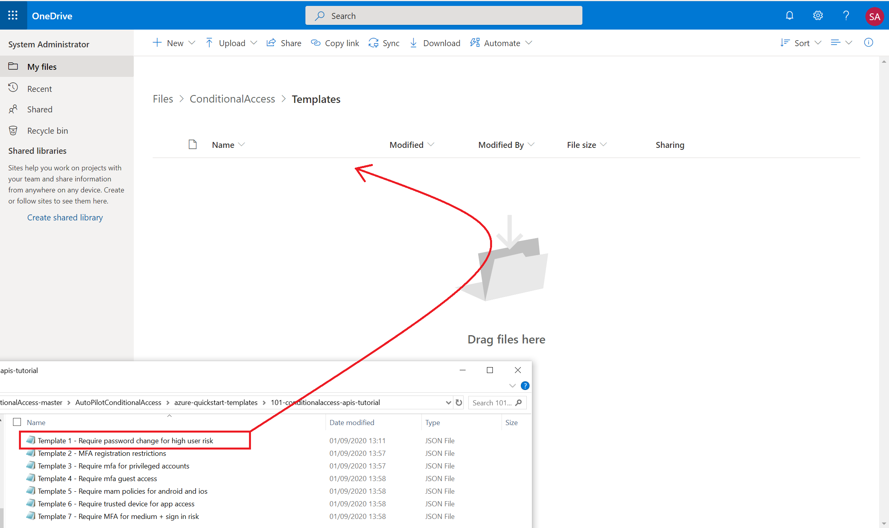
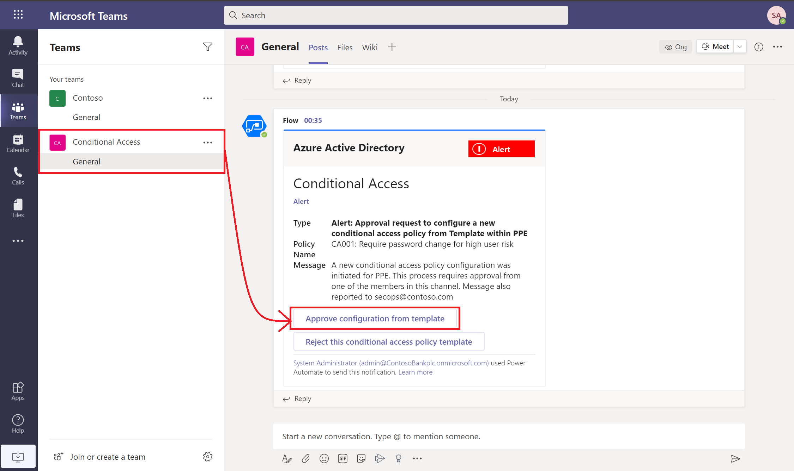
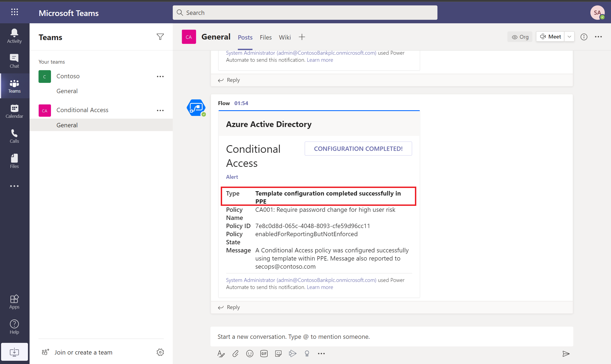
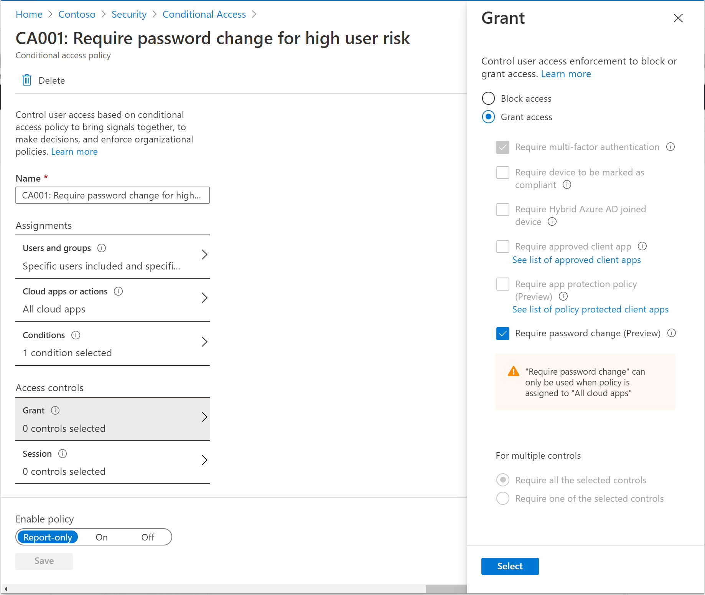
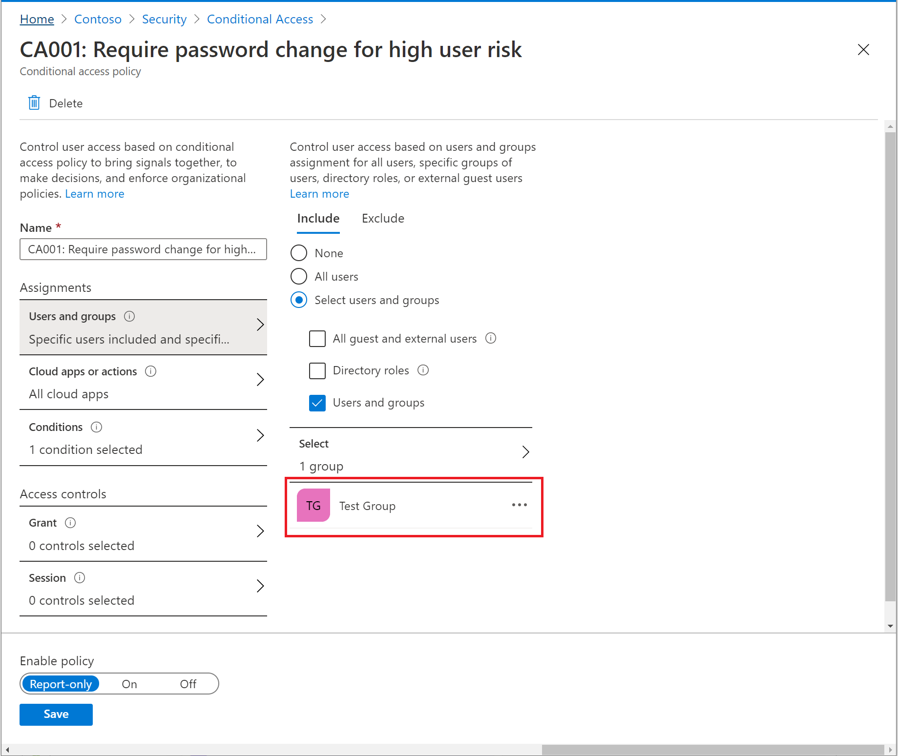
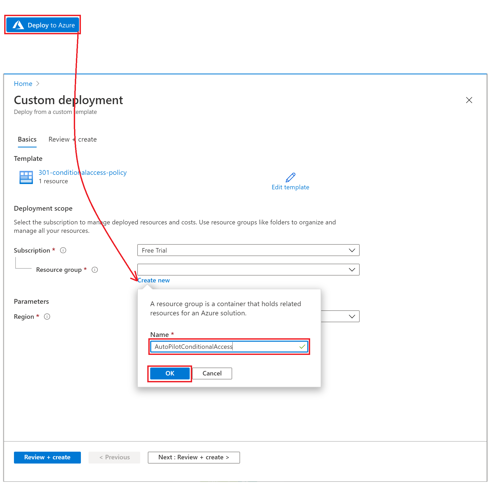

# Configure Conditional Access policies using templates based on Microsoft Graph APIs

Intent: As an IT admin, I want to be able to easily configure Conditional Access policies within my pre-production environment.

You can use the Conditional Access APIs to easily deploy Conditional Access policies in your pre-production environment using Temlates. For example, you can:

As a IT admin, be able to copy a template policy file and configure it in your pre-production environment.

This automation can be very useful for:

- Organizations that manages large numbers of Conditional Access policies. OR
- Identity partners that manages policies for customers.

This tutorial shows how to build a [logic app](https://docs.microsoft.com/azure/logic-apps/) that allows easy configuration of Conditional Access policies using Templates. Specifically, this logic app monitors any policies being pasted in the template folder of OnDrive. If a new policy is detected, an approval workflow is triggered on a Teams channel. Upon approval, the policy is configured in a designated pre-production environment.

In this tutorial, you learn how to:

:heavy_check_mark: Deploy this logic app to your organization.  

:heavy_check_mark: Authenticate your logic app to Azure AD with the right permissions.  

:heavy_check_mark: Add parameters and connections specific to your organization within logic app.  

When you're done, you will be able to manage Conditional Access policies using templates and the following steps within your pre-production environment:

1. Copy your Template and drop it in your OneDrive folder

   

1. Approve Template configuration in Teams

   

1. Receive notification that Template is successfully deployed in your pre-production environment

   

1. View your newly deployed Conditional Access policy in Azure portal

   

1. Assign your Test users to the policy

   

## Prerequisites

If you don't have an Azure subscription, create a [free Azure account](https://azure.microsoft.com/free/?WT.mc_id=A261C142F) before you start.

You will also need knowledge of key concepts within Azure logic apps, OneDrive and Teams.

Complete the steps in the article [Secure authentication for Conditional Access automation](../../00-prereq/readme.md) to create a Key Vault and connect to Managed Identity.

## Step 1: Deploy this logic app to your organization

If your Azure environment meets the prerequisites, and you're familiar with using Azure Resource Manager templates, these steps help you sign in directly to Azure and open the Azure Resource Manager template in the Azure portal. For more information, see the article [Deploy resources with Azure Resource Manager templates and Azure portal](https://docs.microsoft.com/azure/azure-resource-manager/templates/overview).

### Azure Portal

Select the following image to sign in with your Azure account and open the logic app in the Azure portal:

Logic App for Easy Configuration of Conditional Access Policies using Templates.

   
  
1. In the portal, on the **Custom deployment** page, enter or select these values:

   | Property | Value | Description |
   |----------|-------|-------------|
   | **Subscription** | <*Azure-subscription-name*> | The name for the Azure subscription to use |
   | **Resource group** | <*Azure-resource-group-name*> | The name for a new or existing Azure resource group. This example uses `AutoPilotConditionalAccess`. |
   | **Location** |  <*Azure-region-for-all-resources*> | The Azure region to use for all resources, if different from the default value. This example uses the default value, `[resourceGroup().location]`, which is the resource group location. |
   | **Logic App Name** | <*logic-app-name*> | The name to use for your logic app. This example uses `301-conditionalaccess-policy-template-automation`. |

   Here is how the page looks with the values used in this example:

   

1. When you're done, select **Review + Create** and finally **Create**.

## Step 2: Authenticate your logic app to Azure AD with the right permissions

This logic app uses Managed Identity to access secrets from Key Vault to call the Conditional Access APIs. As a prerequisite you must have completed the steps in the article [Secure authentication for Conditional Access automation](../../00-prereq/readme.md) to create a Key Vault and connect to Managed Identity. To learn more about how to use managed identities within Logic Apps, see the article [**Logic Apps and Managed Identities**](https://docs.microsoft.com/azure/logic-apps/create-managed-service-identity).

1. In the left-hand navigation pane, select Identity > User Assigned > Select Add.

1. Select the User-assigned managed identity from the context pane that appears on the right, select Add.

   

## Step 3: Update parameters

1. In the left-hand navigation pane, select Logic App designer > Parameters > Replace the default value with Key Vault URI (storing Client Secret), Client ID and Tenant ID.

   

## Step 4: Connect to your OneDrive account and select the template folder you will like to use for automation

1. On the Logic App Designer, in the OneDrive for Business connection box, click `Connections`. This example uses OneDrive connector for Logic apps:

   

1. If prompted, sign in to your email account with your credentials so that Logic Apps can create a connection to your OneDrive account.

1. If connection is successful, select the OneDrive folder you would like to use for Template automation.

## Step 5: Connect to Teams channel for approving or rejecting Template requests

1. On the Logic App Designer, in the Teams connection box, click `Connections`. This example uses Teams connector:

   

1. If prompted, sign in to your email account with your credentials so that Logic Apps can create a connection to your Teams account.

1. Specify the Team and channel you will like to use for automation of approval workflow.

## Step 6: Select appropriate managed identity

1. On the Logic App Designer, in the HTTP connection box, click `GET client secret from key vault using managed identity`. This example uses HTTP connector.

1. Specify the Managed Identity to use.

   

## Step 7: Update all other connectors within Logic App

Similar to above, update remaining OneDrive and Teams connectors within the sample Logic App by selecting appropriate OneDrive and Teams account that needs to be used for automation.

> [!WARNING]
> Ensure you follow best practices regarding managing secrets within Logic apps by using secure inputs and outputs as documented in the article, [Secure access and data in Azure Logic Apps]](https://docs.microsoft.com/azure/logic-apps/logic-apps-securing-a-logic-app).

## Next steps

Try the following challenge:

:heavy_check_mark: Edit this logic app to send a custom message on Teams channel when the approval workflow selection is Reject action.

:heavy_check_mark: Edit this logic app to delete the policy file in OneDrive template folder when the approval workflow selection is Reject action.

Try creating and updating a Conditional Access policy using the following JSON templates:

- [JSON template - Require MFA for administrative roles](../graphapi/json/template-require-mfa-admin-roles.json)
- [JSON template - Require MFA for B2B and guest users](../graphapi/json/template-require-mfa-b2b-users.json)
- [JSON template - Require MFA for security info registration](../graphapi/json/template-require-mfa-security-info-registration.json)
- [JSON template - Require a trusted device for specific applications](../graphapi/json/template-require-trusted-device-app-access.json)
- [JSON template - Require MFA on medium or high risk (Requires Azure AD Identity Protection)](../graphapi/json/template-require-mfa-risk.json)
- [JSON template - Require MAM policy for Android and IOS devices](../graphapi/json/template-require-mam-android-ios.json)

Preview features and new functionality are added to Conditional Access regularly, as they are added they become available first in the [Conditional Access API beta endpoint](https://docs.microsoft.com/graph/api/resources/conditionalaccesspolicy?view=graph-rest-beta).

Next, [Configure Safe rollout of policies from pre-production to production with approval workflow](../../02-test/readme.md).

For more information on the Conditional Access APIs, see the following documents:

- [Conditional Access API](https://docs.microsoft.com/graph/api/resources/conditionalaccesspolicy?view=graph-rest-1.0)
- [Named location API](https://docs.microsoft.com/graph/api/resources/namedlocation?view=graph-rest-1.0)
