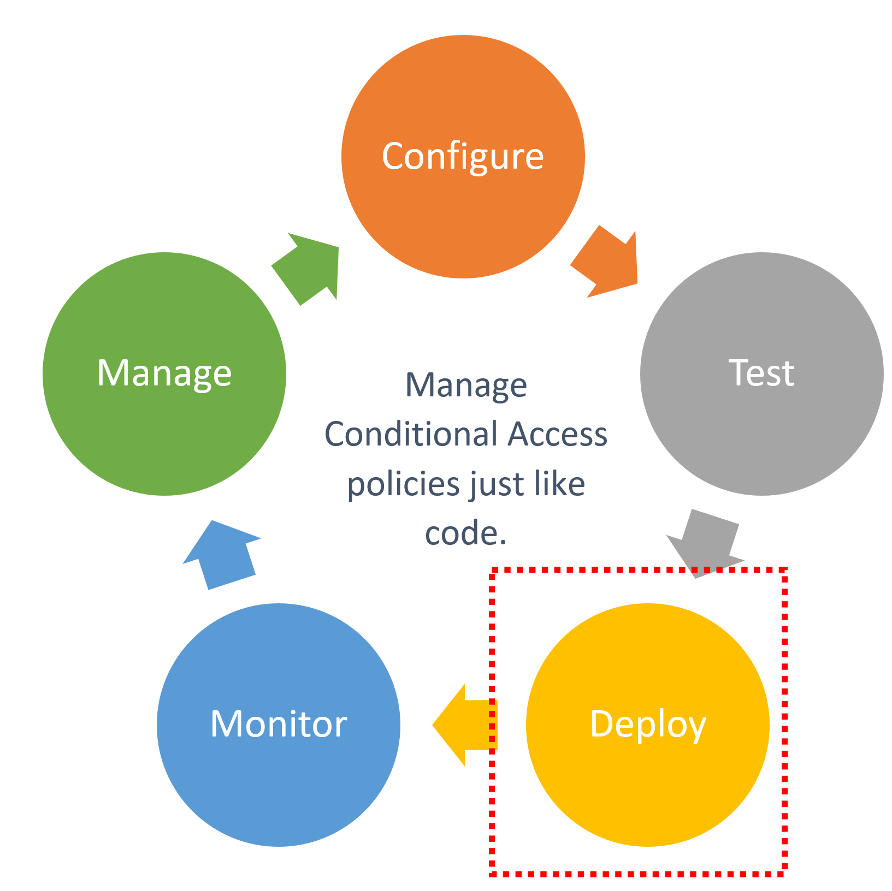
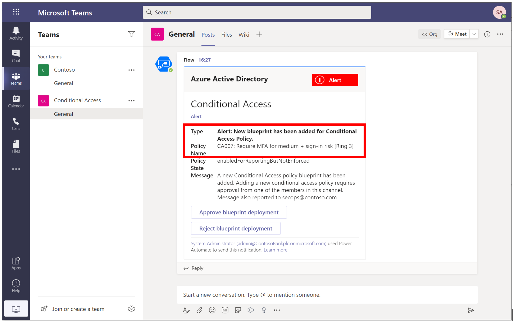
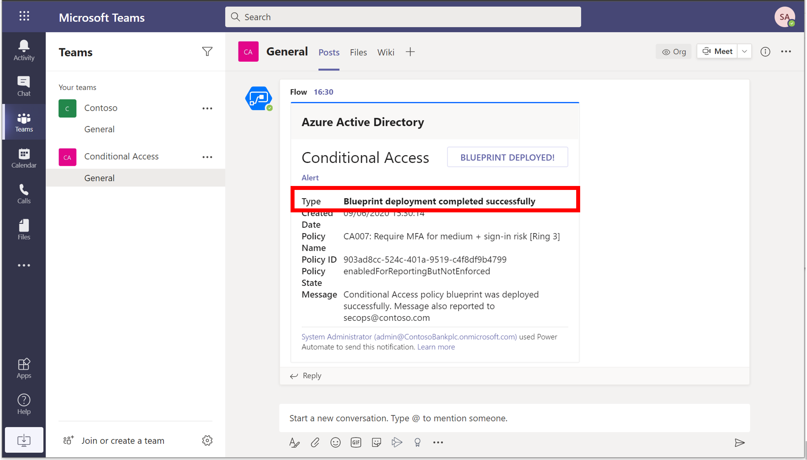
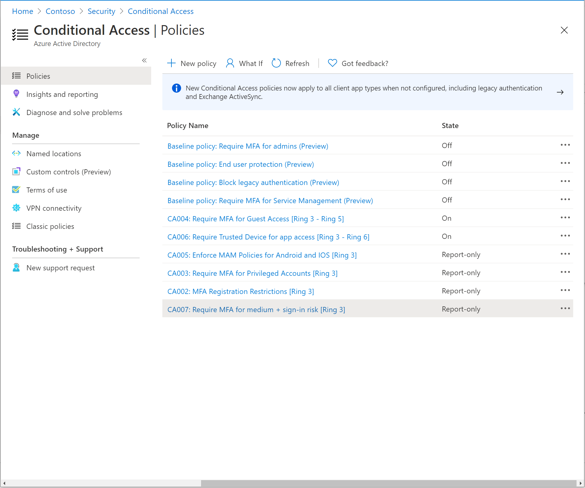
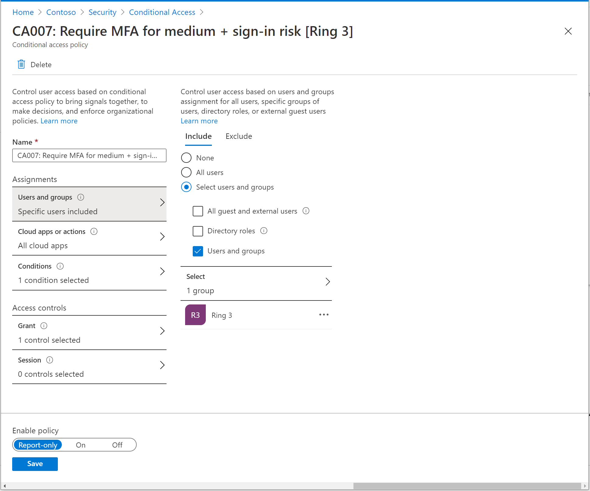
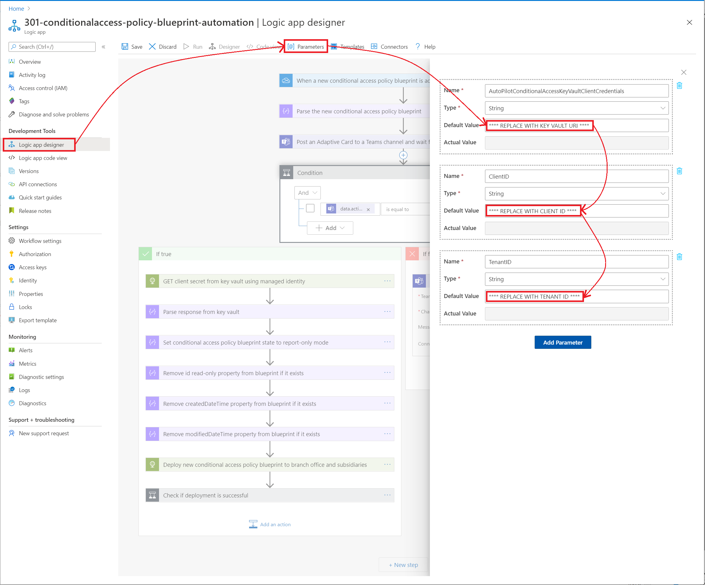
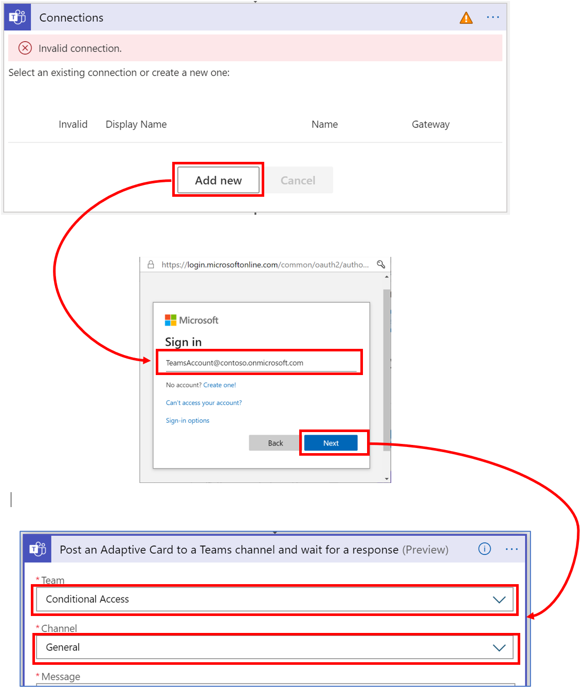

# Tutorial: One-click deploy Conditional Access policies to large number of branch offices and subsidiaries

Intent: As an IT admin, I want to be able to easily deploy Conditional Access policies to large number of branch offices and subsidiaries.

You can use the Conditional Access APIs to manage policy blueprints that you can make available to your branch offices and subsidiaries. For example, you can:

As a central IT admin, add a new policy blueprint to branch offices and subsidiaries shared OneDrive folder. All subsidieries and branch offices will receive notification to create a new Conditional Access policy based on the policy blueprint. Admins in branch offices and subsidiaries can approve or reject this blueprint. If approved, the policy blueprint will be deployed.

   

This automation can be very useful for:

- Organizations that manages large numbers of Azure AD tenants representing branch offices and subsidiaries.
- Identity partners that manages policy blueprints for a large number of customers.
- Mergers and acquisitions.

This tutorial shows how to build a [logic app](../logic-apps/logic-apps-overview.md) that automates policy blueprint deployment to branch offices and subsidiaries based on an approval-based workflow. Specifically, this logic app monitors a branch offices or subsidiaries OneDrive folder for new policy blueprints submissions, sends requests for approval, and deploys the policy blueprint on approval.

Note: The logic app needs to be deployed in each branch offices and subsidiaries tenant that needs to automate one click deployment of Conditional Access policies.

In this tutorial, you learn how to:

:heavy_check_mark: Deploy this logic app to your organization.

:heavy_check_mark: Authenticate your logic app to Azure AD with the right permissions.

:heavy_check_mark: Add parameters and connections specific to your organization within logic app.

When you're done, you will be able to deploy Conditional Access policies to large number of branch offices and subsidiaries

1. Central IT admin, uploads a blueprint to a branch office OneDrive folder.

   

1. Branch office admin gets approval request in Teams

   

1. Branch office admin receives notification that deployment action is successfully completed.

   

1. Branch office admin can view the newly deployed Conditional Access policy in Azure portal

   

1. Branch office admin adds user assignment within the policy

   

## Prerequisites

If you don't have an Azure subscription, create a [free Azure account](https://azure.microsoft.com/free/?WT.mc_id=A261C142F) before you start.

## Step 1: Deploy this logic app to your organization

If your Azure environment meets the prerequisites, and you're familiar with using Azure Resource Manager templates, these steps help you sign in directly to Azure and open the Azure Resource Manager template in the Azure portal. For more information, see the article, [Deploy resources with Azure Resource Manager templates and Azure portal](https://docs.microsoft.com/azure/azure-resource-manager/templates/overview).

Select the following image to sign in with your Azure account and open the logic app in the Azure portal:

   

1. In the portal, on the **Custom deployment** page, enter or select these values:

   | Property | Value | Description |
   |----------|-------|-------------|
   | **Subscription** | <*Azure-subscription-name*> | The name for the Azure subscription to use |
   | **Resource group** | <*Azure-resource-group-name*> | The name for a new or existing Azure resource group. This example uses `AutoPilotConditionalAccess`. |
   | **Location** |  <*Azure-region-for-all-resources*> | The Azure region to use for all resources, if different from the default value. This example uses the default value, `[resourceGroup().location]`, which is the resource group location. |
   | **Logic App Name** | <*logic-app-name*> | The name to use for your logic app. This example uses `301-conditionalaccess-policy-blueprint-automation`. |

   Here is how the page looks with the values used in this example:

   

1. When you're done, select **Review + Create** and finally **Create**.

## Step 2: Authenticate your logic app to Azure AD with the right permissions

This logic app uses managed identity for getting secrets from key vault in order to call Conditional Access APIs. For more information, see the article, [Authenticate your logic app to Azure AD with the right permissions](https://github.com/videor/AutoPilotConditionalAccess/tree/master/AutoPilotConditionalAccess/azure-quickstart-templates/docs) for steps to create key vault and connect to managed identity. To learn more on how to use managed identities within a logic app, see the article, [**Logic Apps and Managed Identities**](https://docs.microsoft.com/azure/logic-apps/create-managed-service-identity).

1. In the left-hand navigation pane, select Identity > User Assigned > Select Add.

1. Select the User-assigned managed identity from the context pane that appears on the right, select Add.

   

## Step 3: Update parameters

1. In the left-hand navigation pane, select Logic App designer > Parameters > Replace the default value with Key Vault URI (storing Client Secret), Client ID and Tenant ID.

   

## Step 4: Connect to your OneDrive account and select the Backup and Restore folders in respective logic apps you will like to use for automation

1. On the Logic App Designer, in the OneDrive for Business connection box, click `Connections`. This example uses OneDrive connector for Logic apps:

   

1. If prompted, sign in to your email account with your credentials so that Logic Apps can create a connection to your OneDrive account.

1. If connection is successful, select the OneDrive folder you would like to use for automation.

## Step 5: Connect to Teams channel for approving or rejecting Restore requests

1. On the Logic App Designer, in the Teams connection box, click `Connections`. This example uses Teams connector:

   

1. If prompted, sign in to your email account with your credentials so that Logic Apps can create a connection to your Teams account.

1. Specify the Team and channel you will like to use for automation of approval workflow.

## Step 6: Select appropriate managed identity

1. On the Logic App Designer, in the HTTP connection box, click `GET client secret from key vault using managed identity`. This example uses HTTP connector.

1. Specify the Managed Identity to use.

   

## Step 7: Update all other connectors within Logic App

Similar to above, update remaining OneDrive and Teams connectors within the sample Logic App by selecting appropriate OneDrive and Teams account that needs to be used for automation.

> [!WARNING]
> Ensure you follow best practices regarding managing secrets within Logic apps by using secure inputs and outputs as documented in the article, [Secure access and data in Azure Logic Apps]](https://docs.microsoft.com/azure/logic-apps/logic-apps-securing-a-logic-app).

## Next steps

Try cloning the logic and build workflows to manage update and deletion of policy blueprints and rollout the changes to your organization.

Next, [Configure alerts on Conditional Access Policy changes](../04-monitor/readme.md).
