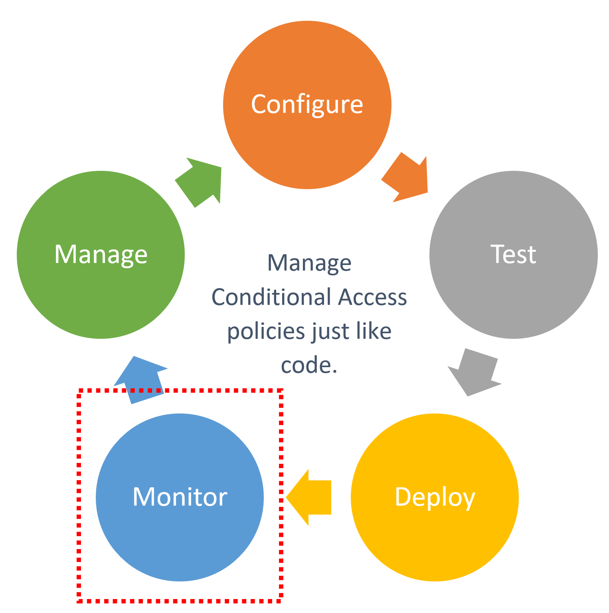
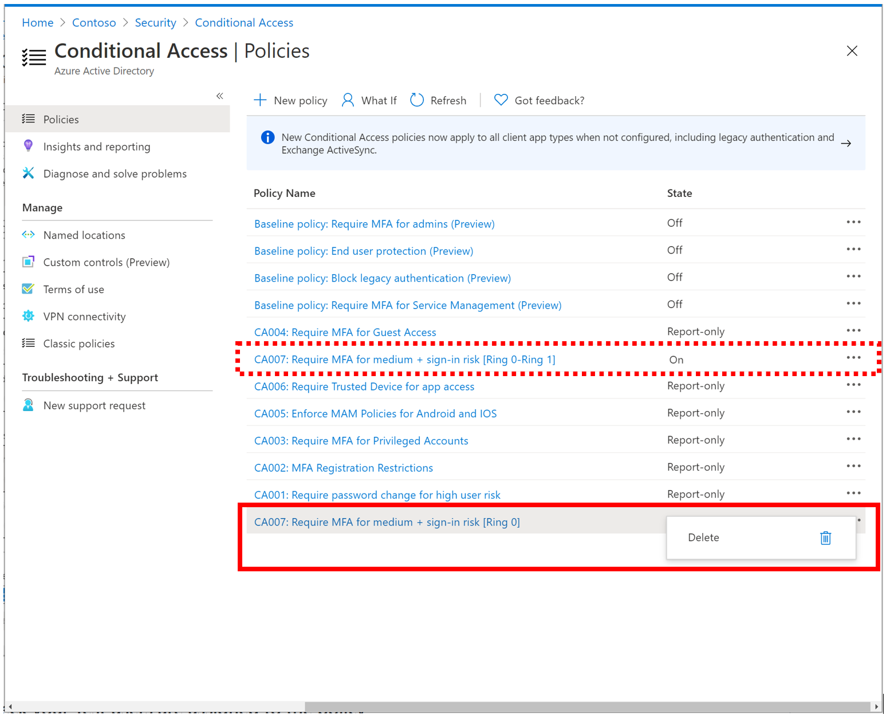
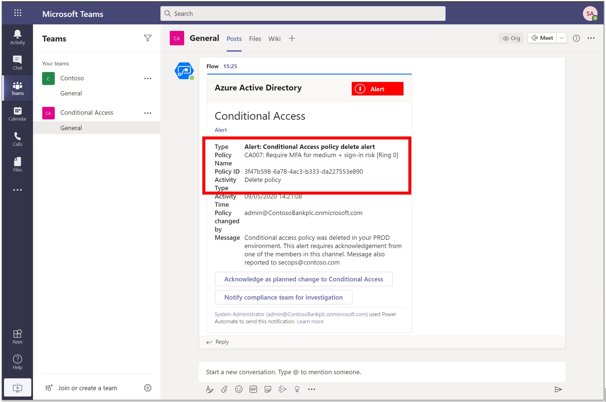
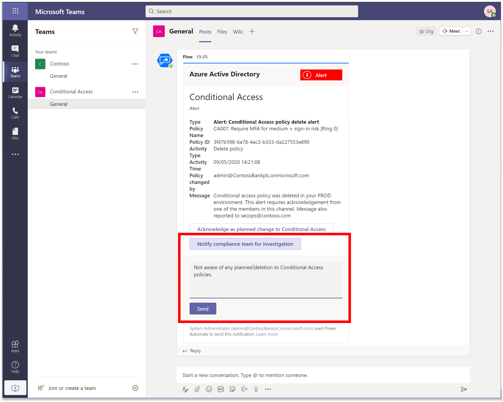
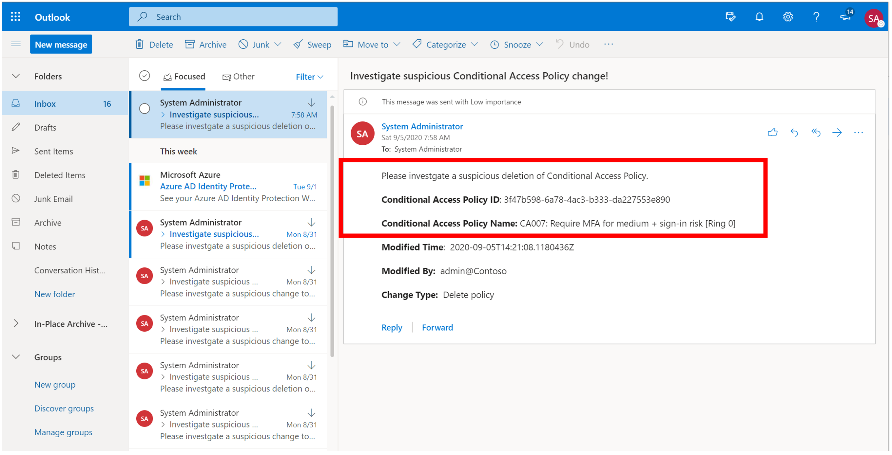
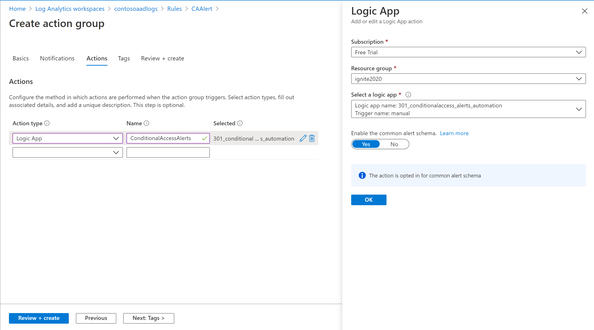
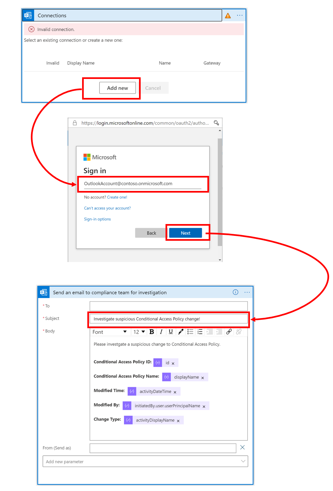

# Tutorial: Alert on Conditional Access Policy changes

Intent: As an IT admin, I want to be able to easily setup alerts on Conditional Access policy changes.

You can use the Conditional Access APIs to manage alerts on policy changes. For example, you can:

As a IT admin, add, update or delete a Conditional Access policy using conditional APIs or UI and be able to set up alerts that fire when CA policies are changed.

   

This automation can be very useful for:

- Organizations that manages large numbers of Conditional Access policies.
- Identity partners that manages policies for customers.

This tutorial shows how to build a [logic app](https://docs.microsoft.com/azure/logic-apps/) that automates policy alerts. Specifically, this logic app monitors the audit logs for policy changes and triggers alert on Teams channel.

In this tutorial, you learn how to:

:heavy_check_mark: Deploy this logic app to your organization.

:heavy_check_mark: Authenticate your logic app to Azure AD with the right permissions.

:heavy_check_mark: Add parameters and connections specific to your organization within logic app.

When you're done, you will be able to get alert on changes made to Conditional Access policies in your production environment.

1. Delete a Ring 0 Conditional Access policy when you have tested and enabled policy with Ring 0 and Ring 1 assignment.

   

1. Acknowledge Alert in Teams as planned change

   

1. Investigate a change to Conditional Access policy action in Teams

   

1. Investigate a change to Conditional Access policy further email

   

## Prerequisites

If you don't have an Azure subscription, create a [free Azure account](https://azure.microsoft.com/free/?WT.mc_id=A261C142F) before you start.

## Step 1: Deploy this logic app to your organization

If your Azure environment meets the prerequisites, and you're familiar with using Azure Resource Manager templates, these steps help you sign in directly to Azure and open the Azure Resource Manager template in the Azure portal. For more information, see [Deploy resources with Azure Resource Manager templates and Azure portal](https://docs.microsoft.com/azure/azure-resource-manager/templates/overview).

Select the following image to sign in with your Azure account and open the logic app in the Azure portal:

   

1. In the portal, on the **Custom deployment** page, enter or select these values:

   | Property | Value | Description |
   |----------|-------|-------------|
   | **Subscription** | <*Azure-subscription-name*> | The name for the Azure subscription to use |
   | **Resource group** | <*Azure-resource-group-name*> | The name for a new or existing Azure resource group. This example uses `AutoPilotConditionalAccess`. |
   | **Location** |  <*Azure-region-for-all-resources*> | The Azure region to use for all resources, if different from the default value. This example uses the default value, `[resourceGroup().location]`, which is the resource group location. |
   | **Logic App Name** | <*logic-app-name*> | The name to use for your logic app. This example uses `301-conditionalaccess-policy-alert-automation`. |

Here is how the page looks with the values used in this example:

   

1. When you're done, select **Review + Create** and finally **Create**.

## Step 2: Authenticate your logic app to Azure AD with the right permissions

This logic app uses Managed Identity to get secrets from Key Vault in order to call the Conditional Access APIs. For more information on configuring these features, see the steps in the article [Secure authentication for Conditional Access APIs](../../doc/readme.md).

1. In the left-hand navigation pane, select Identity > User Assigned > Select Add.

1. Select the User-assigned managed identity from the context pane that appears on the right, select Add.

   

## Step 3: Update parameters

1. In the left-hand navigation pane, select Logic App designer > Parameters > Replace the default value with Key Vault URI(storing Client Secret), Client ID and Tenant ID.

   

## Step 4: Add the Audit Logs Webhook

### Create an alert rule

1. Sign in to the [Azure portal](https://portal.azure.com) with an account assigned to the Monitoring Contributor role in Azure Monitor.
1. Select **All services**", enter "log analytics" in Search and then select **Log Analytics workspaces**.
1. Select a workspace.
1. In your workspace, select **Alerts** > **New alert rule**.
   1. Under **Resource**, verify that the subscription is the one with which you want to associate the alert rule.
   1. Under **Condition**, select **Add**.
   1. Select **Custom log search** under **Signal name**.
   1. Under **Search query**, enter the following query.

   `AuditLogs | where OperationName == "Add policy" or OperationName == "Update policy" or OperationName == "Delete policy"`

      > [!NOTE]
      > You will notice a additional log entry for Conditional Access policy changes which targets Default policy. We will filter the duplicates later in the logic app.

1. Under **Alert logic**, enter the following:

   - Based on: Number of results
   - Operator: Greater than
   - Threshold value: 0

1. Under **Evaluated based on**, select the **Period (in minutes)** for how long you want the query to run, and the **Frequency (in minutes)** for how often you want the query to run. The frequency should be less than or equal to the period.
1. Select **Done**. You may now view the estimated monthly cost of this alert.
1. Select an action group of users to be notified by the alert. If you want to create one, see [Create an action group](#create-an-action-group).
1. To customize the email notification sent to the members of the action group, select actions under **Customize Actions**.
1. Under **Alert Details**, specify the alert rule name and add an optional description.
1. Set the **Severity level** of the event. We recommend that you set it to **Critical(Sev 0)**.
1. Under **Enable rule upon creation**, leave it set as **yes**.
1. To turn off alerts for a while, select the **Suppress Alerts** check box and enter the wait duration before alerting again, and then select **Save**.
1. Click **Create alert rule**.

### Create an action group

1. Select **Create an action group**.

   

1. Verify the subscription and resource group.
1. Enter the action group name and a display name.
1. Under Actions, action type, select **Logic App**.
1. Enter an action name such as **ConditionalAccessAlerts**.
1. Select the **Logic App** that you deployed for this sample.
1. Select **Review + Create** to review the information, and then select **Create** to save the details.

## Step 5: Select appropriate managed identity

1. On the Logic App Designer, in the HTTP connection box, click `GET client secret from key vault using managed identity`. This example uses HTTP connector.

1. Specify the Managed Identity to use.

   

## Step 6: Connect to Teams channel for accepting or notifying for further investigation

1. On the Logic App Designer, in the Teams connection box, click `Connections`. This example uses Teams connector:

   

1. If prompted, sign in to your email account with your credentials so that Logic Apps can create a connection to your Teams account.

1. Specify the Team and channel you will like to use for automation of approval workflow.

## Step 7: Connect to your Outlook account you will like to use for automation

1. On the Logic App Designer, in the Outlook connection box, click `Connections`. This example uses Outlook connector for Logic apps:

   

1. If prompted, sign in to your email account with your credentials so that Logic Apps can create a connection to your Outlook account.

1. If connection is successful, select the Outlook account you would like to sent alerts for further investigation.

## Step 8: Update all other connectors within Logic App

Similar to above, update remaining OneDrive and Teams connectors within the sample Logic App by selecting appropriate OneDrive and Teams account that needs to be used for automation.

> [!WARNING]
> Ensure you follow best practices regarding managing secrets within Logic apps by using secure inputs and outputs as documented in the article, [Secure access and data in Azure Logic Apps]](https://docs.microsoft.com/azure/logic-apps/logic-apps-securing-a-logic-app).

## Next steps

Try the following challenge:

:heavy_check_mark: Edit this logic app to send further policy details such as Policy State information. This will allow you to check of the policy was changed to **Report-only** or **Off** state before it was deleted as part of lifecycle.

Next, [Configure backup and restore of Conditional Access policies with approval workflow](../05-manage/01-backup-restore/readme.md).
