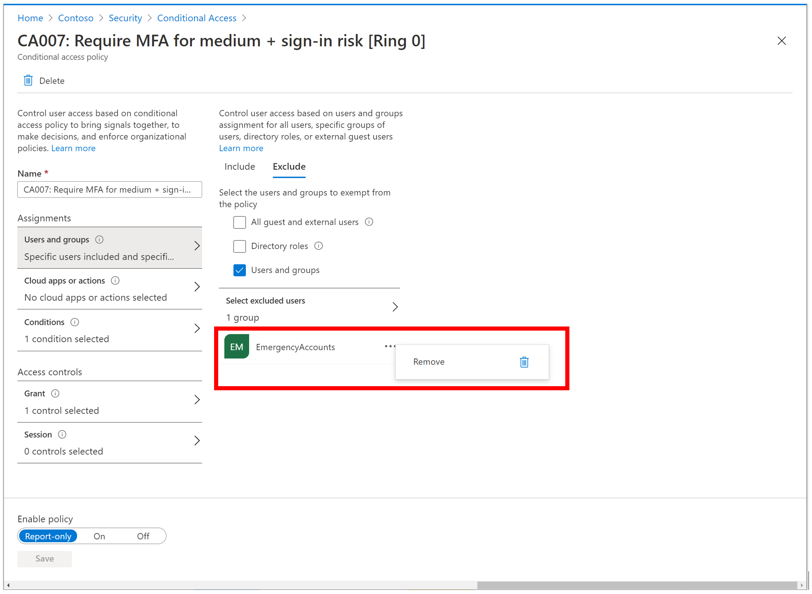
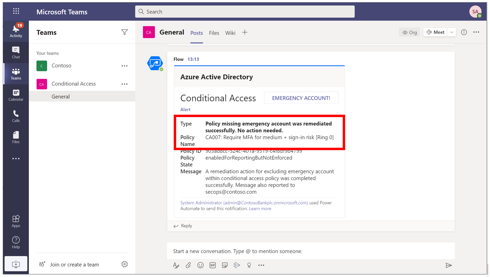
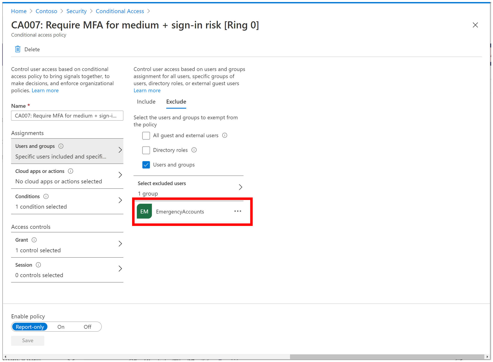

# Tutorial: Emergency account management within Conditional Access policies

Intent: As an IT admin, I want to be able to automate management of emergency account within Conditional Access policies.

You can use the Conditional Access APIs to automate management of emergency accounts within Conditional Access policies. For example, you can:

- Automatically exclude emergency accounts from all new Conditional Access policies.
- Auto-remediate when a Conditional Access policy has been updated accidentally or maliciously to remove emergency account.
- Get an alert on missing emergency account and remediation actions taken for a Conditional Access policy.

   

This automation can be very useful for:

- Organizations that manages large numbers of Conditional Access policies.
- Identity partners that manages policies for customers.

This tutorial shows how to build a [logic app](https://docs.microsoft.com/azure/logic-apps/) that automates emergency account management. Specifically, this logic app retrieves all Conditional Access policies as a scheduled task. Checks if the policy has necessary exclusions, and if it doesn't, updates the Conditional Access policy and triggers an alert on Team channel.

In this tutorial, you learn how to:

:heavy_check_mark: Deploy this logic app to your organization.

:heavy_check_mark: Authenticate your logic app to Azure AD with the right permissions.

:heavy_check_mark: Add parameters and connections specific to your organization within logic app.

When you're done, you will be able to automate management of emergency account within Conditional Access policies.

1. Remove emergency account from a Conditional Access policy.

   

1. Receive notification that a policy was missing emergency account exclusion and it was remediated.

   

1. View your remediated Conditional Access policy in Azure portal

   

## Prerequisites

If you don't have an Azure subscription, create a [free Azure account](https://azure.microsoft.com/free/?WT.mc_id=A261C142F) before you start.

## Step 1: Deploy this logic app to your organization

If your Azure environment meets the prerequisites, and you're familiar with using Azure Resource Manager templates, these steps help you sign in directly to Azure and open the Azure Resource Manager template in the Azure portal. For more information, see the article [Deploy resources with Azure Resource Manager templates and Azure portal](https://docs.microsoft.com/azure/azure-resource-manager/templates/overview).

Select the following image to sign in with your Azure account and open the logic app in the Azure portal:

   

/json/azuredeploy.json

1. In the portal, on the **Custom deployment** page, enter or select these values:

   | Property | Value | Description |
   |----------|-------|-------------|
   | **Subscription** | <*Azure-subscription-name*> | The name for the Azure subscription to use |
   | **Resource group** | <*Azure-resource-group-name*> | The name for a new or existing Azure resource group. This example uses `AutoPilotConditionalAccess`. |
   | **Location** |  <*Azure-region-for-all-resources*> | The Azure region to use for all resources, if different from the default value. This example uses the default value, `[resourceGroup().location]`, which is the resource group location. |
   | **Logic App Name** | <*logic-app-name*> | The name to use for your logic app. This example uses `301-conditionalaccess-policy-emergency-account-automation`. |
   ||||

   Here is how the page looks with the values used in this example:

   

1. When you're done, select **Review + Create** and finally **Create**.

## Step 2: Authenticate your logic app to Azure AD with the right permissions

This logic app uses managed identity for getting secrets from key vault in order to call Conditional Access APIs. For more information, see the article [Authenticate your logic app to Azure AD with the right permissions](https://github.com/videor/AutoPilotConditionalAccess/tree/master/AutoPilotConditionalAccess/azure-quickstart-templates/docs) for how to create key vault and connect to managed identity. To learn more about how to use managed identities within Logic Apps, see the article [**Logic Apps and Managed Identities**](https://docs.microsoft.com/azure/logic-apps/create-managed-service-identity).

1. In the left-hand navigation pane, select Identity > User Assigned > Select Add.

1. Select the User-assigned managed identity from the context pane that appears on the right, select Add.

   

## Step 3: Update parameters

1. In the left-hand navigation pane, select Logic App designer > Parameters > Replace the default value with Key Vault URI (storing Client Secret), Client ID, Emergency accounts group object ID (group you want to exclude from all Conditional Access policies) and Tenant ID.

   

## Step 4: Select appropriate managed identity

1. On the Logic App Designer, in the HTTP connection box, click `GET client secret from key vault using managed identity`. This example uses HTTP connector.

1. Specify the Managed Identity to use.

   

## Step 5: Connect to Teams channel for notification

1. On the Logic App Designer, in the Teams connection box, click `Connections`. This example uses Teams connector:

   

1. If prompted, sign in to your email account with your credentials so that Logic Apps can create a connection to your Teams account.

1. Specify the Team and channel you will like to use for automation.

## Step 6: Update all other connectors within Logic App

Similar to above, update remaining Teams connectors within the sample Logic App by selecting appropriate Teams account that needs to be used for automation.

> [!WARNING]
> Ensure you follow best practices regarding managing secrets within Logic apps by using secure inputs and outputs as documented in the article, [Secure access and data in Azure Logic Apps]](https://docs.microsoft.com/azure/logic-apps/logic-apps-securing-a-logic-app).

## Next steps

Try the following challenge:

:heavy_check_mark: Edit this logic app to send a approval request on Teams channel before remediation action is taken.

Next, [Configure business continuity with contingency policies and Conditional Access](../03-contingency/readme.md).
