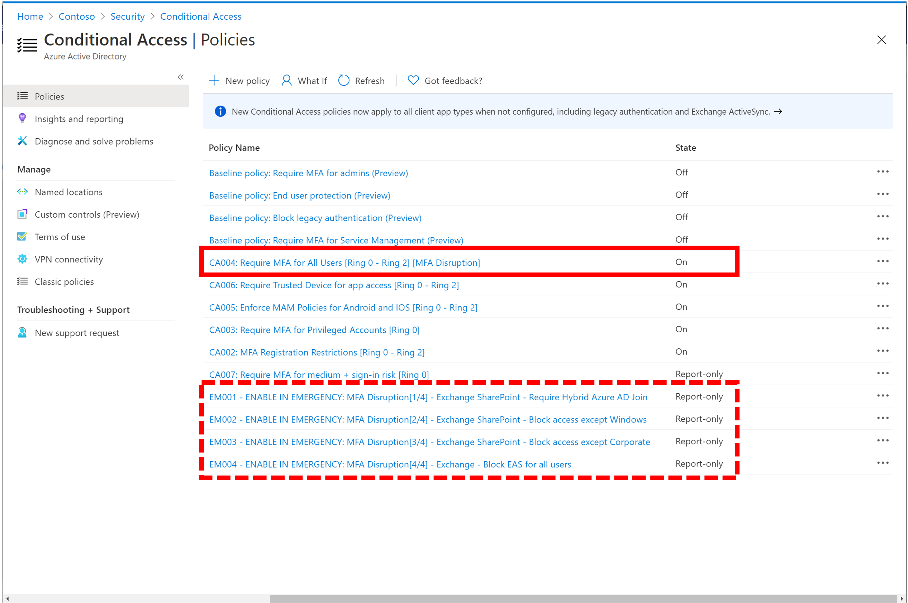
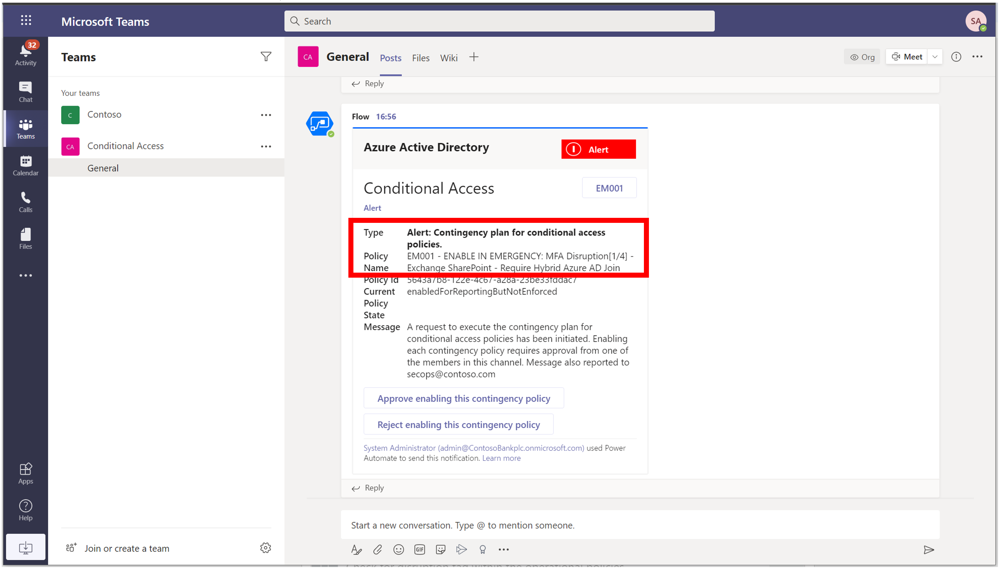
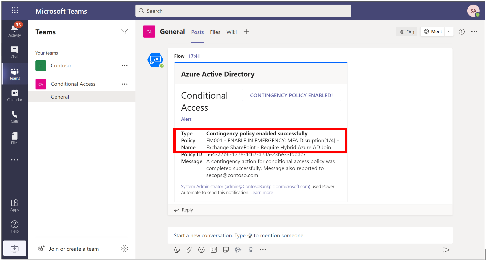
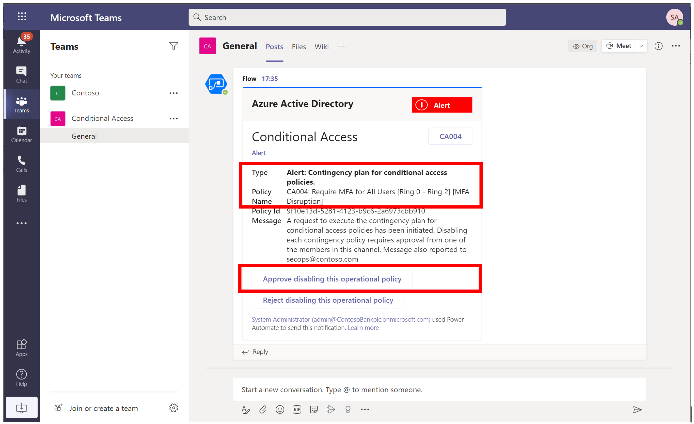
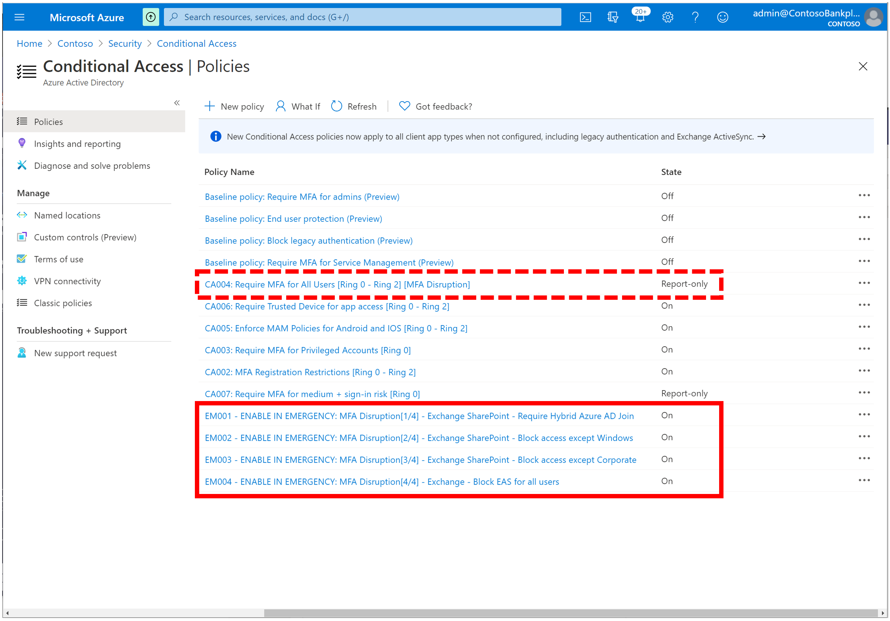
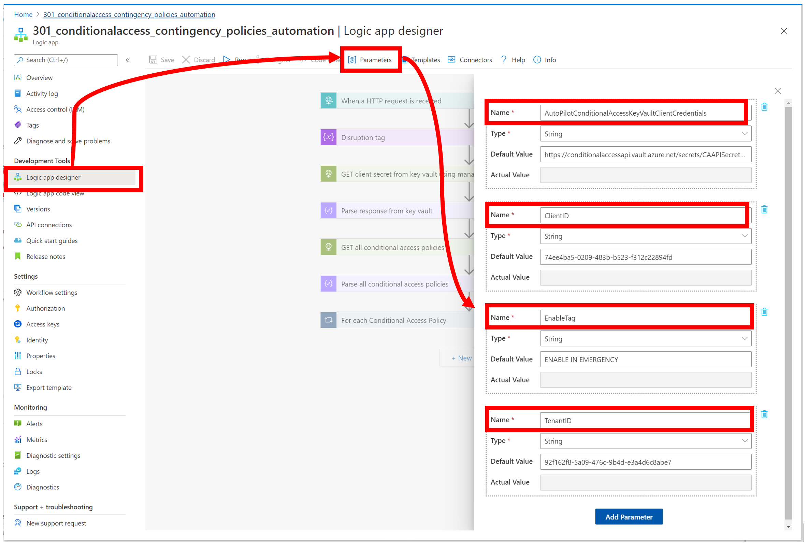
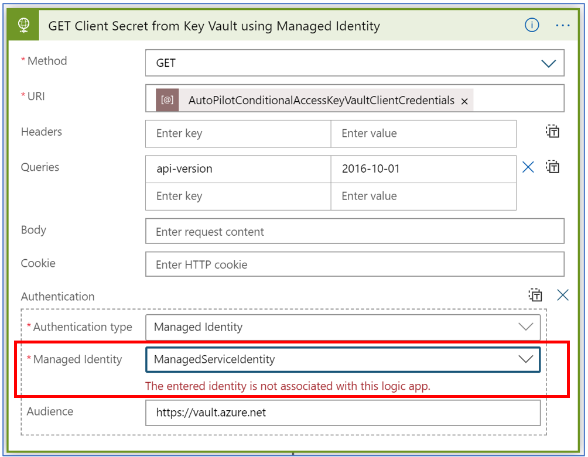

# Tutorial: Business continuity with contingency policies and Conditional Access

Intent: As an IT admin, I want to be able to easily fail-over to contingency policies during service issues.

You can use the Conditional Access APIs to manage failover to contingency policies. For example, you can:

Trigger fail-over with an approval workflow in a Teams channel. Members can approve or reject the fail-over. If approved, the contingency policy is enabled and relevant operational policies are disabled.

   

This automation can be very useful for:

- Organizations that manages large numbers of Conditional Access policies.
- Identity partners that manages policies for customers.

This tutorial shows how to build a [logic app](https://docs.microsoft.com/azure/logic-apps/) that automates fail-over to contingency policies. Specifically, this logic app is [triggered with a specific disruption tag](https://docs.microsoft.com/azure/connectors/connectors-native-reqres). This sends an alert to a Teams channel with list of contingency policies specific to that disruption. Admins, can individually select and approve fail-over.

In this tutorial, you learn how to:

:heavy_check_mark: Deploy this logic app to your organization.

:heavy_check_mark: Authenticate your logic app to Azure AD with the right permissions.

:heavy_check_mark: Add parameters and connections specific to your organization within logic app.

When you're done, you will be able to automate management of contingency policies.

1. Ensure you have contingency policies configured for a given disruption and relevant operational policies are tagged for same disruption. Below example shows contingency policies configured for MFA Disruption.

   

1. When the logic app is triggered, receive approval request to **enable contingency policies** in Teams.

   

1. Receive success notification in Teams.

   

1. Receive approval request to **disable tagged operational policies** in Teams.

   

1. Check contingency policies are now enabled in Azure Portal.

   

## Prerequisites

If you don't have an Azure subscription, create a [free Azure account](https://azure.microsoft.com/free/?WT.mc_id=A261C142F) before you start.

Complete the steps in the article [Secure authentication for Conditional Access automation](../../00-prereq/readme.md) to create a Key Vault and connect to Managed Identity.

## Step 1: Deploy this logic app to your organization

If your Azure environment meets the prerequisites, and you're familiar with using Azure Resource Manager templates, these steps help you sign in directly to Azure and open the Azure Resource Manager template in the Azure portal. For more information, see the article, [Deploy resources with Azure Resource Manager templates and Azure portal](https://docs.microsoft.com/azure/azure-resource-manager/templates/overview).

Select the following image to sign in with your Azure account and open the logic app in the Azure portal:

   

1. In the portal, on the **Custom deployment** page, enter or select these values:

   | Property | Value | Description |
   |----------|-------|-------------|
   | **Subscription** | <*Azure-subscription-name*> | The name for the Azure subscription to use |
   | **Resource group** | <*Azure-resource-group-name*> | The name for a new or existing Azure resource group. This example uses `AutoPilotConditionalAccess`. |
   | **Location** |  <*Azure-region-for-all-resources*> | The Azure region to use for all resources, if different from the default value. This example uses the default value, `[resourceGroup().location]`, which is the resource group location. |
   | **Logic App Name** | <*logic-app-name*> | The name to use for your logic app. This example uses `301-conditionalaccess-contingency-policies-automation`. |

   Here is how the page looks with the values used in this example:

    to create a Key Vault and connect to Managed Identity. To learn more about how to use managed identities within Logic Apps, see the article [**Logic Apps and Managed Identities**](https://docs.microsoft.com/azure/logic-apps/create-managed-service-identity).

1. In the left-hand navigation pane, select Identity > User Assigned > Select Add.

1. Select the User-assigned managed identity from the context pane that appears on the right, select Add.

   

## Step 3: Update parameters

1. In the left-hand navigation pane, select Logic App designer > Parameters > Replace the default value with Key Vault URI (that stores client secret), Client ID, Enable Tag (based on your naming convention) and Tenant ID.

   

## Step 4: Select appropriate managed identity

1. On the Logic App Designer, in the HTTP connection box, click `GET client secret from key vault using managed identity`. This example uses HTTP connector.

1. Specify the Managed Identity to use.

   

## Step 5: Connect to Teams channel for notification

1. On the Logic App Designer, in the Teams connection box, click `Connections`. This example uses Teams connector:

   

1. If prompted, sign in to your email account with your credentials so that Logic Apps can create a connection to your Teams account.

1. Specify the Team and channel you will like to use for automation.

## Step 6: Update all other connectors within Logic App

Similar to above, update remaining Teams connectors within the sample Logic App by selecting appropriate Teams account that needs to be used for automation.

> [!WARNING]
> Ensure you follow best practices regarding managing secrets within Logic apps by using secure inputs and outputs as documented in the article, [Secure access and data in Azure Logic Apps]](https://docs.microsoft.com/azure/logic-apps/logic-apps-securing-a-logic-app).

## Next steps

Try the following challenge:

:heavy_check_mark: Edit this logic app to trigger staggered alerts based on sequence number within policy display name. This sequence represents the order in which you must activate the policies.
